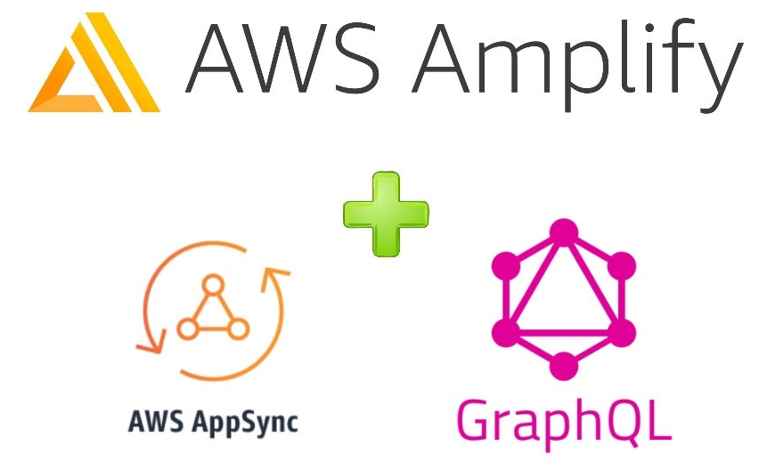

<br />
<p align="center">
  <a href="#content">
    
  </a>

  <h3 align="center">AWS AppSync GraphQL React App</h3>

  <p align="center">
    Practising material from Udemy course  
    <br />
    <br />
  </p>
</p>

## Getting Started

First, run the development server:

```bash
npm run dev
# or
yarn dev
```

Open [http://localhost:3000](http://localhost:3000) with your browser to see the result.

You can start editing the page by modifying `pages/index.js`. The page auto-updates as you edit the file.

=======

## Blog App with AWS AppSync and Amplify CLI

This is a full-fledged Blog web app created using Amplyfy CLI, AWS AppSync and NextJS for the frontend. All of the instructions and steps can be found in the accompanying course: [https://www.udemy.com/course/aws-appsync-amplify-with-react-graphql-course](https://www.udemy.com/course/aws-appsync-amplify-with-react-graphql-course).
